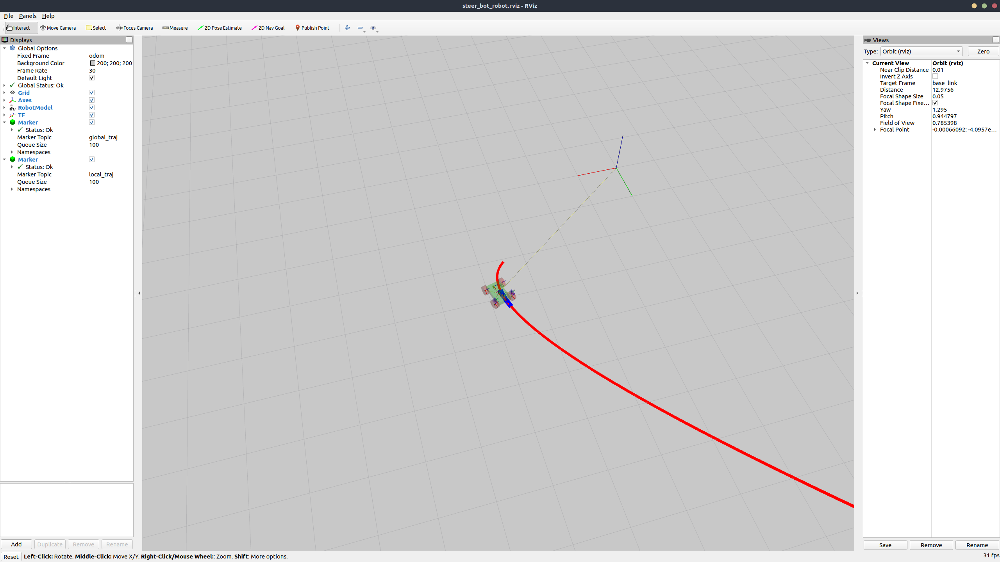
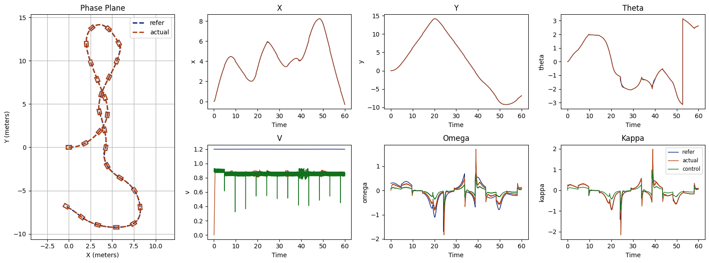

Ackermann mpc trajectory tracking, using osqp-eigen as solver, gazebo, rviz and protobuf for visualization and analysis

*env*: `ros-noetic, Gazebo, Rviz`

*third_party*: `osqp, osqp-eigen, steer_bot, protobuf`

**Run**
```bash
#! need to install osqp in system to use osqp-eigen first, details in osqp-eigen

git clone https://github.com/DongDongWw/simple_ackermann_tracking.git
git submodule update --init --recursive

# Check dependencies
rosdep check --from-paths src --ignore-src --rosdistro melodic
# Install dependencies
rosdep install --from-paths src --ignore-src --rosdistro melodic -y

# ros build proj
catkin_make -DCMAKE_BUILD_TYPE=Debug -DCMAKE_EXPORT_COMPILE_COMMANDS=ON
# roslaunch
source devel/setup.bash # or zsh
roslaunch traj_tracking traj_tracking.launch
```

**Rviz**


**Visualization**

